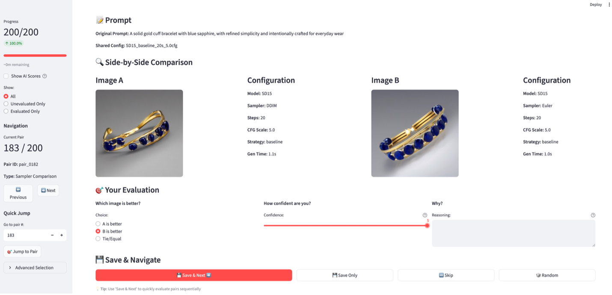
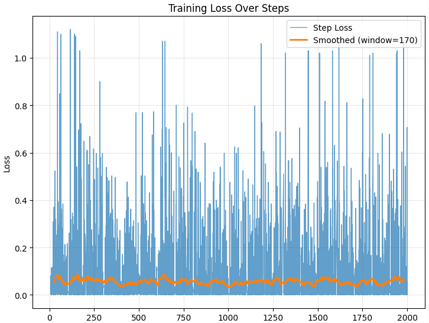

# Improving Stable Diffusion for Modern, Prompt-Accurate Jewelry Images

## Introduction

Arcade's customers need generative models that produce jewelry imagery faithful to prompts and aligned with modern aesthetics. Current pain points:
- __Prompt adherence__ — descriptors like “channel-set diamond” or “threader earrings” are often ignored.
- __Aesthetic drift__ - outputs default to ornate or catalog styles rather than the clean, contemporary look of brands like Mejuri or Catbird.

My objective was to improve Stable Diffusion 1.5 so outputs are both prompt-faithful and on-trend.

## Approach

- __Baseline model__ - I began my experiments with the Stable Diffusion v1.5 (SD15). This checkpoint allowed much faster iteration and experimentation compared to XL models, which was critical for testing multiple configurations within the assignment timeframe.

### Techniques explored

- __Prompt engineering__: tested compel, numeric weights, and structured prompts. Tried negative prompts ranging from generic (“low quality, clutter”) to jewelry-specific (“vintage, overly ornate”).
- __Sampler comparisons__: evaluated Euler Ancestral, DDIM, DPMSolver++ variants across different step counts (20-50) and CFG scales (5-9).
- __LoRA fine-tuning__: trained adapters on small curated sets (25-30 images per category) for specific jewelry categories (threader earrings, channel-set bands, and huggie hoops). Iteratively improved training using increased learning rate to 1e-4, used constant LR scheduler with warmup, expanded network rank to 32.
- __Rare token__: introduced custom tokens (sks for channel-set, phol for threader) in captions to reinforce grounding and improve prompt adherence.
- __Caption refinement__: Replaced generic captions with detailed, consistent phrases (e.g., "threader earrings, white background, studio lighting").
- __Evaluation metrics__ ran CLIP similarity, jewelry term adherence, LAION aesthetic scoring, GPT-5 label generation, and human evaluation. CLIP and LAION aesthetic scoring proved insufficient (38.4% and 51.4% prediction accuracy respectively) so I relied on comparative analysis of the human evaluator to identify optimal production configuration.

  

<em>Figure 1. Human evaluation interface used to validate optimal configuration selection</em>

### Rationale

**Prompt Adherence (Pain-point #1):**
- **LoRA Specialization**: Fine-tuned adapters specifically learn jewelry taxonomy and technical terminology that base models often ignore.
- **Compel Integration**: Implemented weighted prompt parsing to emphasize technical jewelry terms like "channel-set diamond" and "threader earrings".

**Modern Aesthetic (Pain-point #2):**
- **Parameter Optimization**: CFG scale of 9.0 with 20 steps balanced quality and modern clean aesthetics.
- **Curated Training Data**: LoRA training used exclusively modern, minimalist jewelry images matching brands like Mejuri and Catbird.

## Evidence

### Quantitative results:

- CLIP similarity and LAION aesthetic scores were inconsistent with human judgment.
- GPT-5–generated labels, however, showed __clearer improvements__ across iterations, better reflecting prompt adherence and aesthetic quality.
- This suggests that automated metrics are useful as references, but domain-specific labeling (with GPT-5 or curated schema) tracks progress more reliably. [ADD HERE]
- Based on comparative human evaluations, the best-performing setup was Euler Ancestral (62.5% win rate), medium compel (60%), CFG = 9 (75%), and 20 steps (66.7%)

### Training observations:
- Most LoRA runs plateaued quickly given the small datasets and loss curves appeared mostly flat.
- Despite the lack of signal in the training curves, visual inspection showed meaningful improvement. For example, in the evolution grid, early checkpoints produced stud-like earrings, while later checkpoints generated convincing threader earrings with elongated chains, bezel-set stones, and modern proportions.
- This confirms that for jewelry, loss curves alone are not reliable; qualitative inspection and prompt-specific labeling are essential for measuring progress.
- While parameter tuning (sampler, steps, CFG) influenced outcomes, the bigger driver of quality was having more curated data with strong captions. Simply changing parameters was not enough to consistently improve prompt adherence or modern aesthetics.

  
  

<em>Figure 2. Left: flat loss curve during training. Right: visual grid showing qualitative improvements.</em>

## Next Steps 

**Achievable within one week**

- __Expand datasets and captions__: Curate 60–120 images per category and rewrite captions with a consistent schema (material, setting, background, style). Using GPT-5 labeling helps accelerate this.
- __LoRA refinements (cross attention + text encoder)__: Run shorter, targeted LoRA trainings (~1200 steps for small sets) with higher rank (16–32) and a brief text encoder training phase to improve grounding.
- __Batch generation with reranking__: Generate 16–64 candidates per prompt and rerank with GPT-5 labels.
- __ControlNet integration (lightweight)__: Apply edge or depth maps to stabilize composition (e.g., keeping prong counts, stone size).

**Longer-term extensions**

- **Dreambooth and Textual Inversion hybrids**: Use Dreambooth for deeper concept integration.
- **Textual Inversion Hybrid**: For specific maker styles while maintaining LoRA for category-level styling
- **Jewelry-specific aesthetic model**: A domain-tuned scorer to replace LAION metrics and better capture jewelry quality.
- **Taxonomy-based routing**: Automatically select the right stack of hyper-specialized LoRA adapters based on detected jewelry parameters (e.g., category, type, material, style).
- **Enhanced VAE**: Swap SD15's default VAE with alternatives for improved stability and detail.
- **Reference-guided generation (ImageRAG)**: Use exemplar product photos to maintain proportions, geometry, and brand consistency.

This systematic approach addresses both core pain-points through quantified optimization and human validation, providing a robust foundation for production deployment in jewelry image generation.
